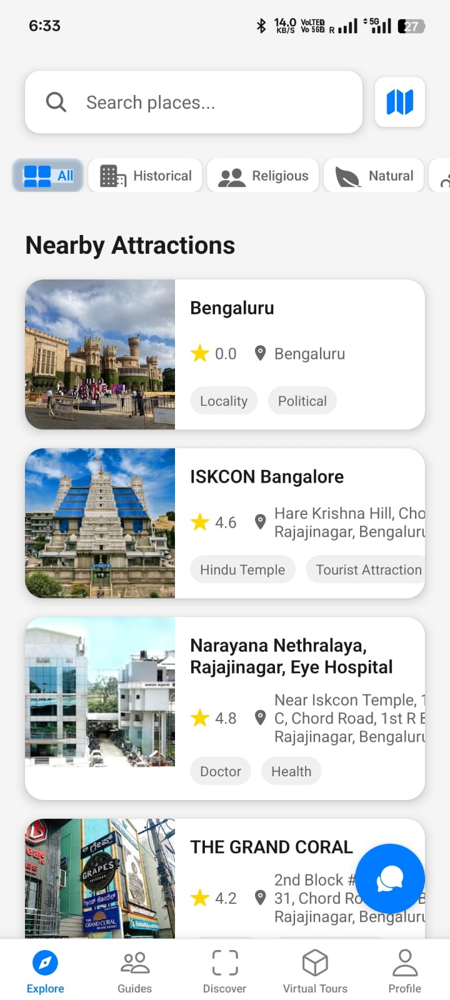

# Heritage Explorer 🏛️

A mobile application designed to revolutionize heritage tourism through immersive technology and smart navigation.

## 🌟 Features

- Virtual Reality Tours of Historical Sites
- Smart Navigation with Cultural Context
- Interactive Cultural Experiences
- Multilingual Support
- Offline Mode for Remote Locations
- Augmented Reality Historical Information

## 🛠️ Tech Stack

- Frontend: React Native
- Backend: Node.js & Express
- Database: MongoDB
- Authentication: Supabase
- Maps Integration: Google Maps API

## 📱 Screenshots

<div align="center">
  
</div>

## 🚀 Getting Started

### Prerequisites

- Node.js 14.0+
- React Native Environment
- MongoDB
- Unity (for AR/VR features)

### Installation

```bash
# Clone the repository
git clone https://github.com/shubhamkr790/heritage-explorer.git

# Install dependencies
npm install

# Start the development server
npm start
```

## 👥 Team Error 2.O

We are a team of passionate developers from SRM Institute of Science and Technology.

### Team Members
- **Shubham Kumar** (Team Leader)
  - Role: Fullstack Developer
  - Email: shubhamkr.srmist@gmail.com

- **Komal Kumari**
  - Role: Frontend Developer


## 🎯 Problem Statement

Developing a mobile application that enhances heritage tourism by offering:
- Virtual tours of historical monuments
- Smart navigation with cultural context
- Interactive cultural experiences
- Real-time translation and information
- Augmented reality features
=======
<p align="center">Made with ❤️ by Team Error 2.O</p>

